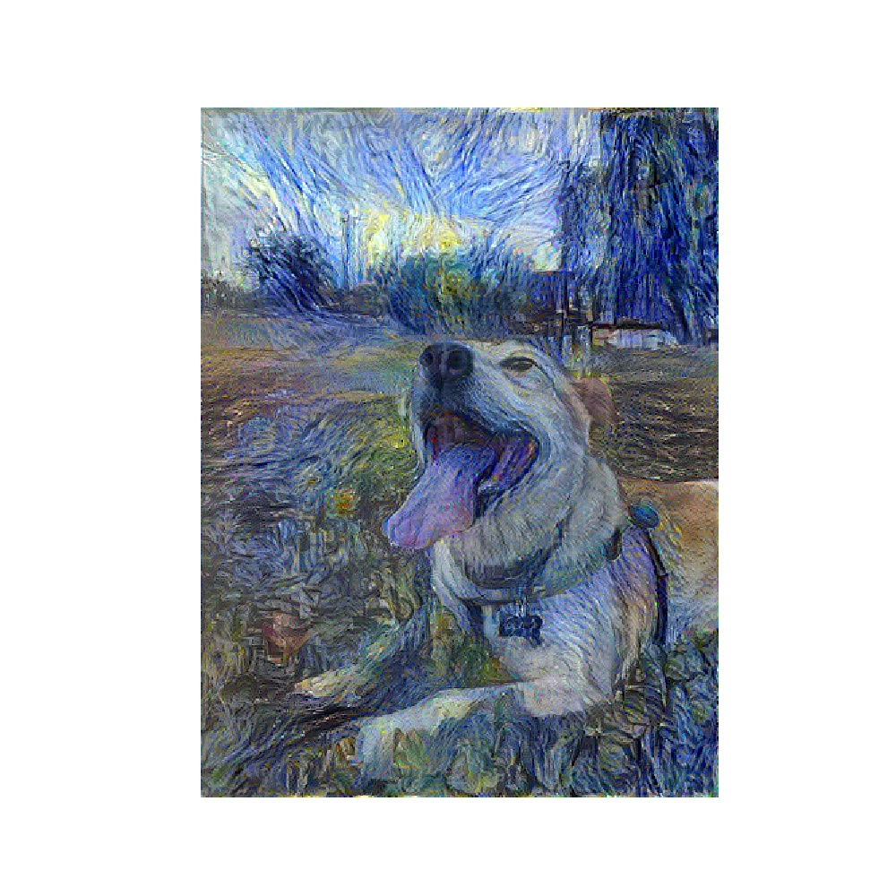

# Style Transfer Network

The goal of this project is to generate some nice looking images, and practice a unique application of neural networks. I use tensorflow to run the image generation, along with a pretrained model, VGG19, to select both style and content features.

Here are a few of the images I made (mostly using photos of the dog):

 

